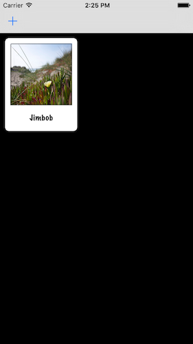

# NameToFaces
Repo following Project 10: Names to Faces with UICollectionView tutorial at www.hackingwithswift.com.  The goal of this project is to build an app that helps you remember names with the person's face and learning UICollectionView in the process.

This repo also follows Project 12: NSUserDefaults, NSCoding, and more as a technique tutorial on an existing project.  This tutorial will add the ability to save data so that when you exit the app, the names and faces you added will still be there.



## Concepts Learned/Practiced in Project 10
* UICollectionView
  * Adding ```UICollectionViewDataSource``` and ```UICollectionViewDelegate``` protocols to the ViewController class
* Creating custom classes
  * Created PersonCell and Person custom classes
* ```UIImagePickerController``` class
* Using ```NSUUID``` object's ```UUIDString``` method to create a unique ID name
* Saving image to JPEG and writing to disk.
* Initializer method to create instances of a class
  * Example from project:

    ```swift
    init(name: String, image: String) {
      self.name = name
      self.image = image
    }
    ```

## Concepts Learned/Practiced in Project 12
* ```NSUserDefaults``` class
  * Example syntax:
    ```swift

      let defaults = NSUserDefaults.standardUserDefaults()
      let array = ["Hello", "World"]
      defaults.setObject(array, forKey: "SavedArray")

    ```
* ```NSCoding``` protocol
* ```NSKeyedUnarchiver``` and ```NSKeyedArchiver``` class
* Nil coalescing operator: ```??```
  * Example:

    ```
      let loadedArray = defaults.objectForKey("SavedArray") as? [String] ?? [String]()

    ```
    * If code on left side is optional and exists, it gets unwrapped into a non-optional value; if it doesn't exist, it uses the value on the right instead.
    
## Attributions
[Project 10: Name to Faces with UICollectionView](https://www.hackingwithswift.com/read/10/overview)
[Project 12: NSUserDefaults, NSCoding, and more](https://www.hackingwithswift.com/read/12/overview)
